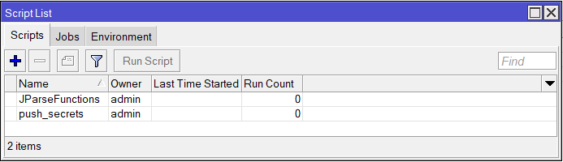

# mikrotik-copy-ppp-secret
## Description
This script permits to copy all secret account of a Mikrotik router to an other one.

The users created on the remote router are those configured on the router where this script is executed.

This script has been tested on RouterOS V7.15.2 and V7.13.5

Thanks to Winand for his Json parser script : [https://github.com/Winand/mikrotik-json-parser/]

## Setup
On your Mikrotik router, you have to create two scripts :
* First is named `JParseFunctions` and contains the content of JParseFunctions.rsc
* The second is named `push_secrets` and contains the content of push_secrets.rsc 
* Before using the script, you must change the environment parameters, they are defined in `push_secrets` script :
  - ```remoteIP``` var is used to store the IP address of the router you want to copy the secrets to
  - ```remoteUser``` var is used to store the user of administration account on the remote router
  - ```remotePassword``` var is used to store the password of administration account on the remote router
  - ```localSecretOnly``` if you want to keep some of your secrets on your router only, add in the comment section of your secrets the string stored in this var
  - ```useHttps``` set it as true if your remote router is set correctly (service enabled and certificate created), set it as false if you want or use http only
* Note that if you have created you own profiles on the router and assigned them to some secret accounts, you have to create them on the remote router before executing this script

## Lauch
Once you have set all the environment variables, you can open a terminal and execute this command ```/system/script/run push_routes```
